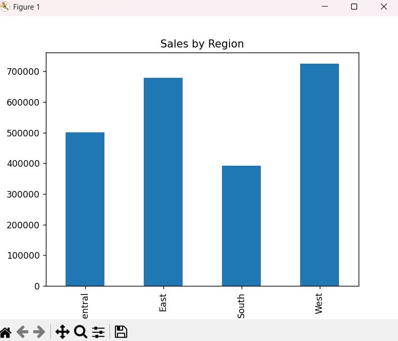

# Superstore Sales Dataset Analysis

This project performs exploratory data analysis on the Superstore sales dataset using Python and Pandas.

## Dataset
- **File**: `SampleSuperstore.csv`
- **Records**: 9,994 rows
- **Columns**: 13 (Ship Mode, Segment, Country, City, State, Postal Code, Region, Category, Sub-Category, Sales, Quantity, Discount, Profit)

## Analysis Performed

### Day 1: Basic Information
- Display first few rows of data
- Dataset shape and structure
- Column names and data types

### Day 2: Data Cleaning & Exploratory Data Analysis (EDA)
- Missing value detection
- Data type inspection
- Statistical summary of numerical columns

### Day 3
- Performed SQL-based analysis using pandasql
- Identified top-performing regions and categories
- Analyzed top-selling products
- Evaluated monthly sales trends

### Key Insights
- **Total Sales**: $2,297,200.86
- **Total Profit**: $286,397.02

#### Sales by Region:
- West: $725,457.82
- East: $678,781.24
- Central: $501,239.89
- South: $391,721.91

#### Sales by Category:
- Technology: $836,154.03
- Furniture: $741,999.80
- Office Supplies: $719,047.03

## Visualizations

### Sales by Region


This chart shows the distribution of sales across the four regions, with the West region leading at $725,457.82, followed by East at $678,781.24.

## Installation


## 📊 Dashboard (Power BI)
- Created interactive dashboard to visualize sales and profit
- Analyzed regional and category-wise performance
- Identified business trends and key insights

### Requirements
- Python 3.7+
- pandas
- matplotlib

### Setup
```bash
pip install pandas matplotlib
```

## Usage

Run the analysis script:
```bash
python analysis.py
```

This will output:
- DataFrame overview and info
- Missing values summary
- Statistical summary
- Sales breakdown by region and category

## File Structure
```
.
├── analysis.py              # Main analysis script
├── SampleSuperstore.csv     # Dataset
└── README.md               # This file
```

## License
MIT License
